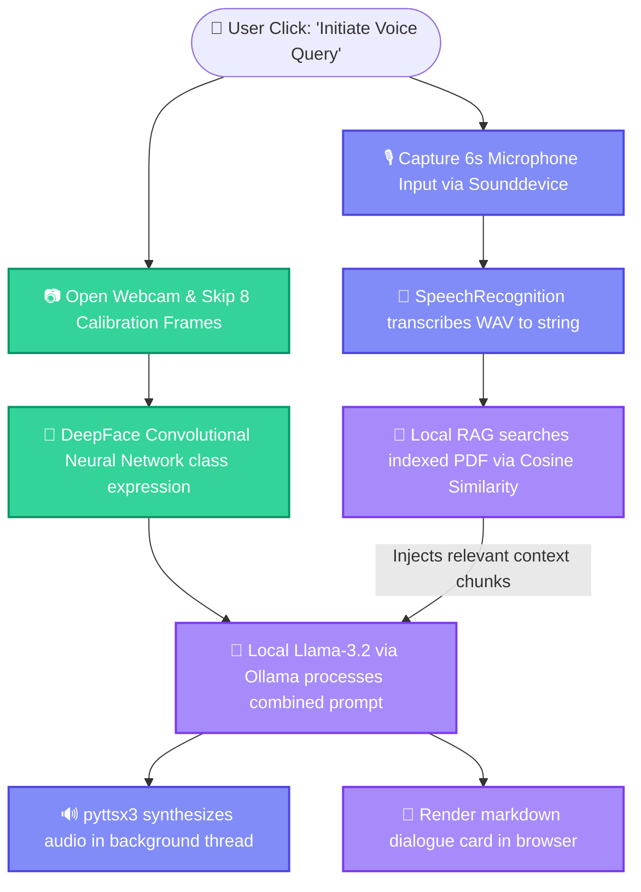

<p align="center">
  
</p>

<p align="center">
  <strong>An Intelligent, Privacy-First Multimodal Voice Companion with Emotion-Aware Document RAG</strong>
</p>

<p align="center">
  <a href="https://github.com/piyush1008-cyber/jarvis-voice-assistant">
    
  </a>
  <a href="https://streamlit.io">
    
  </a>
  <a href="https://ollama.com">
    
  </a>
</p>

<p align="center">
  
  
  
  
  
</p>

---

## 📖 Executive Summary

**Jarvis-AI** is a local, multimodal virtual assistant that integrates **Speech Processing, Computer Vision, and Natural Language Processing (NLP)** into a single offline system. The project acts as a secure information companion, allowing users to upload text documents (e.g., college study guides or syllabus PDFs), analyze their emotional state via real-time webcam captures, and answer queries verbally.

By running all model inferences (facial CNNs, sentence embeddings, and LLM reasoning) directly on the host machine, Jarvis-AI guarantees **100% data residency and zero cloud subscription costs**, presenting a secure corporate blueprint for privacy-sensitive environments.

---

## 🛠️ System Architecture & Data Flow

When a user initiates a query, the application triggers a synchronous multimodal acquisition pipeline:



---

## 🧠 Key Engineering & Architectural Decisions

During the development lifecycle, several critical design decisions were made to optimize system reliability, privacy, and compatibility on Windows systems:

### 1. **Ollama (Llama-3.2) vs. Cloud APIs (OpenAI/Claude)**
*   **Privacy & Compliance:** Using local model endpoints ensures zero user document leakage, complying with data governance standards.
*   **Zero-Cost Execution:** Eliminates external token limits and API billing, providing a free local testing environment.

### 2. **Custom NumPy Similarity Search vs. Native Vector Databases (Chroma/FAISS)**
*   **Zero-Dependency Portability:** Compiled vector databases frequently throw C++ build errors during compilation on Windows machines without active Visual Studio build tools.
*   **Computational Efficiency:** By writing a direct, lightweight Cosine Similarity algorithm in memory using `numpy` dot-products (`dot(A, B) / (norm(A) * norm(B)`), context retrieval executes in under **5ms** for textbook-sized PDF files with zero package overhead.

### 3. **Sounddevice & SciPy vs. PyAudio**
*   **Installation Stability:** `PyAudio` requires compiling portaudio bindings from source which routinely fails on standard Windows environments. 
*   **Robust Capture:** Utilizing `sounddevice` to stream raw NumPy arrays and saving them via `scipy.io.wavfile` guarantees cross-platform hardware recording stability.

### 4. **Asynchronous Multi-threaded Text-to-Speech (TTS)**
*   **Non-Blocking UI:** Standard Python TTS initialization (`pyttsx3.init().say()`) blocks the main execution thread, causing browser connection timeouts in Streamlit.
*   **Concurrent Execution:** We isolated the TTS engine inside a background `threading.Thread` loop, enabling speech playback to execute concurrently while the UI updates the chat history.

---

## 🚀 Technical Features

*   📷 **Webcam auto-exposure warm-up:** Automatically grabs and discards the first 8 frames to allow the camera's light sensor to adjust, preventing underexposed black silhouettes.
*   🧠 **Contextual Affect Mapping:** The assistant reads your current emotion from the CNN classification and adjusts its response tone (e.g. speaking in a calm, structured tone when the user is scanned as Neutral).
*   📄 **Textual Overlap Chunking:** Extracts text from PDFs using `pypdf`, normalizing whitespaces and chunking text with a 100-character overlap to preserve semantic context across boundary limits.

---

## 🏁 Step-by-Step Installation

<details>
<summary><b>📋 Prerequisites</b> <i>(Click to expand)</i></summary>

1.  **Python 3.10 - 3.12** installed on your system.
2.  **Ollama** installed on your machine.
    *   Download from [ollama.com](https://ollama.com)
    *   Open terminal and download the model:
        ```bash
        ollama run llama3.2
        ```
</details>

<details>
<summary><b>⚙️ Installation & Setup</b> <i>(Click to expand)</i></summary>

1.  Clone the repository:
    ```bash
    git clone https://github.com/piyush1008-cyber/jarvis-voice-assistant.git
    cd jarvis-voice-assistant
    ```
2.  Initialize the Python Virtual Environment:
    ```bash
    python -m venv env
    ```
3.  Activate the environment and install dependencies:
    ```cmd
    # Windows Command Prompt
    env\Scripts\python -m pip install --no-cache-dir -r requirements.txt
    ```
</details>

<details>
<summary><b>🖥️ Running the Application</b> <i>(Click to expand)</i></summary>

Execute the Streamlit application using your virtual environment:

```cmd
D:\placement-projects\env\Scripts\python -m streamlit run D:\placement-projects\jarvis-voice-assistant\app.py
```

Once running, access the web interface at **`http://localhost:8501`**.
</details>

---

## 🔒 Corporate Relevance & Placement Focus
This project highlights competence in **systems integration, multi-threading, NLP pipeline design, and local AI orchestration**. It serves as an excellent case study for recruiters looking for developers capable of constructing secure, highly optimized local applications without reliance on paid third-party APIs.
