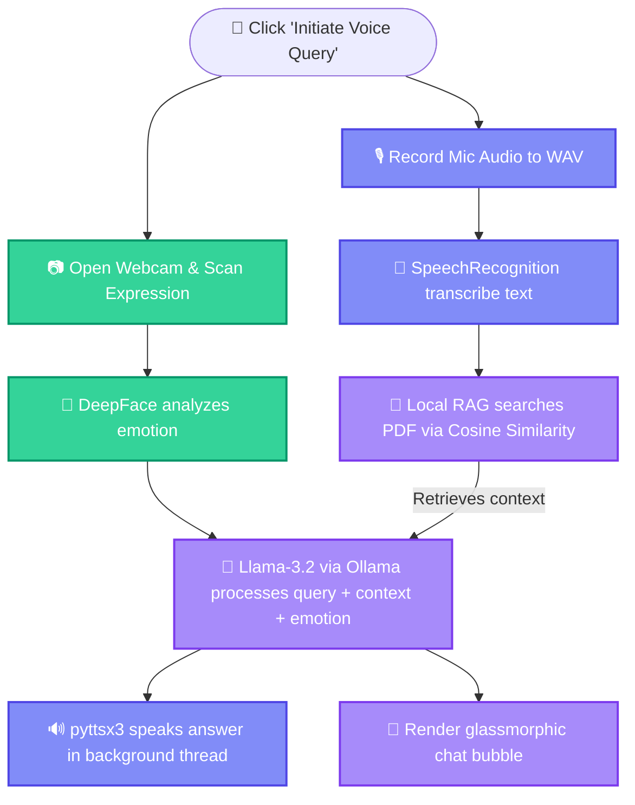

<p align="center">
  
</p>

<p align="center">
  <a href="https://github.com/piyush1008-cyber/jarvis-voice-assistant">
    
  </a>
  <a href="https://streamlit.io">
    
  </a>
  <a href="https://ollama.com">
    
  </a>
</p>

<p align="center">
  
  
  
  
  
</p>

---

## 🌟 Overview

**Jarvis-AI** is a state-of-the-art, **privacy-first local AI assistant** that combines **Speech Processing, Computer Vision, and Natural Language Processing (NLP)** into a single multimodal system. It tracks your facial expression to gauge your emotional context, retrieves relevant information from uploaded documents (PDFs) using semantic vector search (RAG), and answers your questions out loud.

Developed locally, this system runs **100% offline** and requires **no external API keys**, ensuring absolute data privacy.

---

## 🚀 Key Features

*   📷 **Automated Face Scanner (Computer Vision):** Captures your face on voice trigger and uses `DeepFace` CNNs to analyze your emotional state (**Happy, Sad, Angry, Fear, Surprise, Neutral**).
*   🎙️ **Voice-to-Voice Loop:** Voice query transcription using Google Speech API and asynchronous background text-to-speech engine (`pyttsx3`) that doesn't freeze the dashboard.
*   📄 **Local Document RAG (AI Syllabus/PDF Reader):** Extract, chunk, and index PDFs locally using the `all-MiniLM-L6-v2` transformer and fast NumPy cosine similarity.
*   🧠 **Offline Brain (Ollama + Llama-3.2):** High-speed LLM reasoning on your CPU/GPU under 2 seconds.

---

## 🛠️ Tech Stack & Architecture

| Layer | Technology | Purpose |
| :--- | :--- | :--- |
| **Frontend HUD** | `Streamlit (Glassmorphism)` | Professional layout, HUD indicators |
| **Computer Vision** | `OpenCV`, `DeepFace`, `TensorFlow` | Face tracking and emotion classification |
| **Local LLM** | `Ollama`, `Llama-3.2 (3B)` | Core reasoning and response generation |
| **Embeddings & Search** | `Sentence-Transformers`, `Numpy` | RAG vector creation & Cosine Similarity search |
| **Speech Processing** | `SpeechRecognition`, `SoundDevice` | Mic recording & text transcription |
| **Voice Synthesis** | `Pyttsx3 (Multi-threaded)` | Async male vocal feedback engine |

---

## 🧩 How the Pipeline Flows



---

## 🏁 Step-by-Step Local Setup

<details>
<summary><b>1. Prerequisites</b> <i>(Click to expand)</i></summary>

1.  **Python 3.10 to 3.12** installed on your system.
2.  **Ollama** installed on your machine.
    *   Download from [ollama.com](https://ollama.com)
    *   Open terminal and download the model:
        ```bash
        ollama run llama3.2
        ```
</details>

<details>
<summary><b>2. Installation & Setup</b> <i>(Click to expand)</i></summary>

1.  Clone the repository:
    ```bash
    git clone https://github.com/piyush1008-cyber/jarvis-voice-assistant.git
    cd jarvis-voice-assistant
    ```
2.  Create a Python Virtual Environment:
    ```bash
    python -m venv env
    ```
3.  Activate the environment and install dependencies:
    ```cmd
    # Windows
    env\Scripts\python -m pip install -r requirements.txt
    ```
</details>

<details>
<summary><b>3. Running the App</b> <i>(Click to expand)</i></summary>

Start the Streamlit dashboard using your virtual environment:

```cmd
D:\placement-projects\env\Scripts\python -m streamlit run D:\placement-projects\jarvis-voice-assistant\app.py
```

Once running, access the web interface at **`http://localhost:8501`**.
</details>

---

## 🔒 Recruiters & HR Highlights
This project demonstrates advanced competence in **multimodal software engineering, concurrent multi-threading, and local NLP model tuning**. By bypassing expensive external APIs and hosting models locally on-device, this system presents a highly practical, **zero-cost enterprise blueprint** designed for secure corporate environments where data protection is critical.
