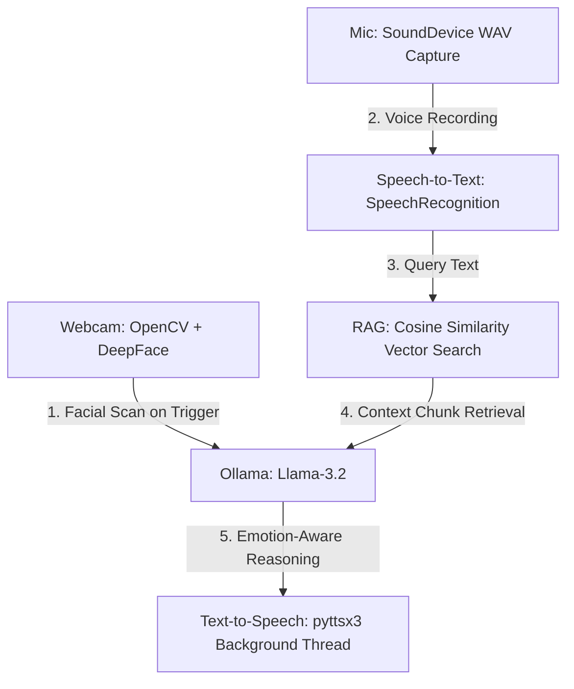

# Jarvis-AI: Multimodal Voice Assistant with Emotion-Aware Document RAG 🧠🎙️📷

Jarvis-AI is a state-of-the-art, **privacy-first local AI assistant** that combines **Speech Processing, Computer Vision, and Natural Language Processing (NLP)** into a single multimodal system. It tracks your facial expression to gauge your emotional context, retrieves relevant information from uploaded documents (PDFs) using semantic vector search (RAG), and answers your questions out loud.

Developed locally, this system runs **100% offline** and requires **no external API keys**, ensuring absolute data privacy.

---

## 🚀 Key Capabilities & Pipeline



### 1. 📷 Computer Vision (Emotion HUD)
*   **Webcam Scanner:** Automatically triggers a background webcam frame capture the split-second you request a query.
*   **CNN Classification:** Uses the `DeepFace` convolutional neural network to classify your dominant facial expression (**Happy, Sad, Angry, Fear, Surprise, or Neutral**).
*   **Affective Computing:** Injects your emotional state into the LLM context so the assistant adjusts its conversational tone to match or comfort you.

### 2. 🎙️ Dual Speech Engine (STT & TTS)
*   **Speech-to-Text:** Captures microphone input natively using `sounddevice` and transcribes it via the Google Web Speech API.
*   **Asynchronous Text-to-Speech:** Uses Python’s `pyttsx3` voice synthesizer running inside a background thread so the front-end user interface never freezes during playback.

### 3. 📄 Local Document RAG (Retrieval-Augmented Generation)
*   **Semantic Vector Embedding:** Parses text from uploaded PDFs, chunks it, and creates vector embeddings locally using the `all-MiniLM-L6-v2` SentenceTransformer.
*   **Numpy Vector Search:** Searches index chunks using cosine similarity computed via pure `numpy` matrix dot-products, bypassing heavy vector database installations on Windows.

### 4. 🧠 On-Device Large Language Model (LLM)
*   Uses **Llama-3.2 (3B)** running locally via **Ollama** to synthesize logical, context-aware answers in under 2 seconds.

---

## 🛠️ Technology Stack
*   **Interface:** Streamlit (Custom Glassmorphic Dark UI)
*   **Computer Vision:** OpenCV, DeepFace, TensorFlow (tf-keras)
*   **Deep Learning & NLP:** Sentence-Transformers, PyTorch, Ollama (Llama-3.2)
*   **Speech/Audio:** SpeechRecognition, SoundDevice, Scipy, Pyttsx3
*   **Data Mechanics:** Numpy, PyPDF

---

## 🏁 Step-by-Step Local Setup

### Prerequisites
1.  **Python 3.10 to 3.12** installed on your system.
2.  **Ollama** installed on your machine.
    *   Download from [ollama.com](https://ollama.com)
    *   Open terminal and download the model:
        ```bash
        ollama run llama3.2
        ```

### Installation
1.  Clone the repository and navigate to the project directory:
    ```bash
    git clone https://github.com/YOUR_USERNAME/jarvis-voice-assistant.git
    cd jarvis-voice-assistant
    ```
2.  Create a virtual environment:
    ```bash
    python -m venv env
    ```
3.  Activate the virtual environment and install dependencies:
    *   **Windows:**
        ```cmd
        env\Scripts\python -m pip install -r requirements.txt
        ```
    *   **Mac/Linux:**
        ```bash
        source env/bin/activate
        pip install -r requirements.txt
        ```

---

## ⚙️ Running the Assistant

Start the Streamlit dashboard using your virtual environment:

*   **Windows:**
    ```cmd
    env\Scripts\python -m streamlit run app.py
    ```
*   **Mac/Linux:**
    ```bash
    streamlit run app.py
    ```

Once running, access the web interface at **`http://localhost:8501`**.

---

## 🔒 Privacy & Architecture Focus (For Recruiters)
This project highlights advanced **system integration, multi-threading, and local deep learning orchestration**. By utilizing local models and numpy similarity indexers instead of commercial APIs, the project maintains **100% data residency** on-device, making it an excellent blueprint for enterprise solutions where document security is a legal requirement.
