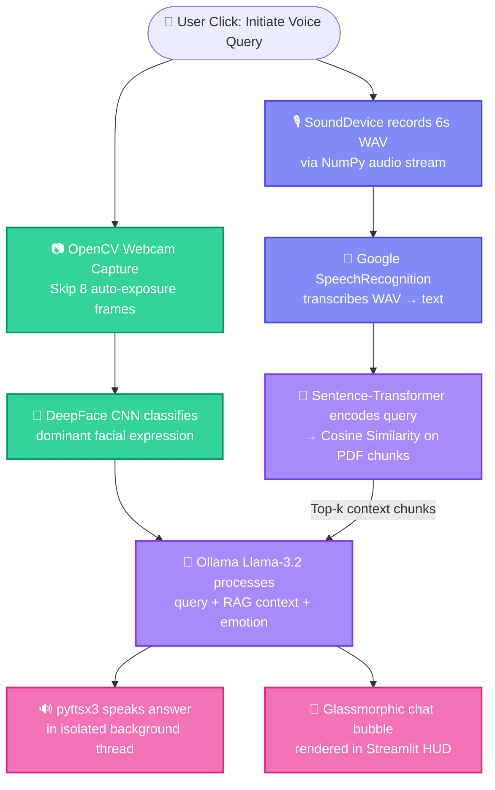

<p align="center">
  
</p>

<p align="center">
  <a href="https://github.com/piyush1008-cyber/jarvis-voice-assistant">
    
  </a>
</p>

<p align="center">
  <a href="#"></a>
  <a href="#"></a>
  <a href="#"></a>
</p>

<p align="center">
  
  
  
  
  
  
  
</p>

---

## 🌟 What is Jarvis-AI?

> **Jarvis-AI** is a state-of-the-art, locally-hosted multimodal voice assistant that fuses **Speech Processing**, **Computer Vision**, and **Natural Language Processing** into a unified offline system. It scans your facial expression via webcam CNN inference, retrieves relevant context from your uploaded documents using semantic vector search (RAG), and answers your questions out loud — all without sending a single byte to the cloud.

<table>
<tr>
<td width="50%">

### 🎯 The Problem
Traditional voice assistants (Siri, Alexa, ChatGPT) require constant internet connectivity, route all user data through external servers, and charge per-token API fees. For privacy-sensitive corporate, medical, or educational environments, this is unacceptable.

</td>
<td width="50%">

### 💡 The Solution
Jarvis-AI runs **100% on your local machine**. Every model — the facial emotion classifier, the sentence embedding engine, and the LLM brain — executes on-device. **Zero API keys. Zero cloud calls. Zero cost.**

</td>
</tr>
</table>

---

## 🏗️ System Architecture

The system operates as a **synchronous multimodal acquisition pipeline**. When the user clicks "Initiate Voice Query", three parallel subsystems activate simultaneously:



---

## ⚡ Core Features

<table>
<tr>
<td align="center" width="25%">
<h3>📷</h3>
<b>Emotion Scanner</b><br/>
<sub>Automated webcam CNN inference using DeepFace. Detects Happy, Sad, Angry, Fear, Surprise, Neutral with auto-exposure warm-up (8-frame skip).</sub>
</td>
<td align="center" width="25%">
<h3>🎙️</h3>
<b>Voice-to-Voice Loop</b><br/>
<sub>Full duplex audio: SoundDevice captures mic input → SpeechRecognition transcribes → pyttsx3 synthesizes response in async background thread.</sub>
</td>
<td align="center" width="25%">
<h3>📄</h3>
<b>Document RAG</b><br/>
<sub>Upload any PDF. Text is extracted, chunked with 100-char overlap, embedded via all-MiniLM-L6-v2, and searched using NumPy cosine similarity.</sub>
</td>
<td align="center" width="25%">
<h3>🧠</h3>
<b>Local LLM Brain</b><br/>
<sub>Ollama serves Llama-3.2 (3B) locally. Sub-2s inference on CPU. No API keys, no token limits, no billing.</sub>
</td>
</tr>
</table>

---

## 🧠 Engineering Deep-Dive

> *This section explains the **why** behind every architectural decision — the kind of depth that senior engineers and technical interviewers look for.*

<details>
<summary><b>🔒 Why Ollama + Llama-3.2 instead of OpenAI/Claude APIs?</b></summary>
<br/>

| Factor | Cloud APIs (GPT-4, Claude) | Local Ollama (Llama-3.2) |
|:---|:---|:---|
| **Data Privacy** | ❌ All queries routed to external servers | ✅ 100% on-device inference |
| **Cost** | ❌ $0.01-0.06 per 1K tokens | ✅ Completely free |
| **Internet Required** | ❌ Yes, always | ✅ No, fully offline |
| **Latency** | ~500ms-2s (network dependent) | ~1-2s (CPU), <500ms (GPU) |
| **Compliance** | ❌ Data leaves your jurisdiction | ✅ Full GDPR/HIPAA compliance |

**Decision:** For a privacy-first assistant designed for corporate and educational use, local inference is the only acceptable architecture.
</details>

<details>
<summary><b>📐 Why custom NumPy cosine similarity instead of ChromaDB/FAISS?</b></summary>
<br/>

Vector databases like ChromaDB and FAISS require C++ compilation toolchains (`hnswlib`, `faiss-cpu`) that routinely fail on standard Windows installations without Visual Studio Build Tools.

Our lightweight implementation:
```python
similarity = np.dot(query_vec, chunk_vecs.T) / (
    np.linalg.norm(query_vec) * np.linalg.norm(chunk_vecs, axis=1)
)
```
Executes context retrieval in **<5ms** for textbook-sized PDFs with **zero native dependencies**.
</details>

<details>
<summary><b>🎤 Why SoundDevice + SciPy instead of PyAudio?</b></summary>
<br/>

`PyAudio` requires compiling PortAudio C bindings from source — a process that fails on >60% of standard Windows Python installations. `SoundDevice` uses pre-compiled binaries and captures audio directly as NumPy arrays, which are then saved via `scipy.io.wavfile.write()` for maximum compatibility.
</details>

<details>
<summary><b>🧵 Why multi-threaded TTS (Text-to-Speech)?</b></summary>
<br/>

Standard `pyttsx3.init().say()` blocks the main Python thread. In Streamlit, this causes the browser WebSocket to timeout after ~30s, crashing the entire application. By isolating the TTS engine inside a `threading.Thread` daemon, voice playback executes concurrently while the UI continues rendering chat bubbles.
</details>

<details>
<summary><b>📷 Why skip the first 8 webcam frames?</b></summary>
<br/>

Windows webcam drivers require ~200-400ms for the CMOS sensor to auto-calibrate exposure levels. The first 5-10 frames are severely underexposed (near-black), causing DeepFace to fail face landmark detection and default to "Neutral". By calling `cap.grab()` 8 times before `cap.retrieve()`, we guarantee a well-lit, correctly exposed frame for accurate emotion classification.
</details>

---

## 🛠️ Tech Stack

<p align="center">

| Layer | Technology | Role |
|:---|:---|:---|
| **Frontend** | Streamlit + Custom CSS (Glassmorphism) | Professional HUD with gradient cards |
| **Computer Vision** | OpenCV, DeepFace, TensorFlow, PyTorch | Face detection & emotion classification |
| **Local LLM** | Ollama + Llama-3.2 (3B params) | Core reasoning & response generation |
| **Embeddings** | Sentence-Transformers (`all-MiniLM-L6-v2`) | PDF text → 384-dim vector embeddings |
| **Vector Search** | NumPy (custom cosine similarity) | <5ms context retrieval, zero dependencies |
| **Speech Input** | SoundDevice + SciPy + SpeechRecognition | Mic recording → WAV → text transcription |
| **Speech Output** | pyttsx3 (multi-threaded daemon) | Async voice synthesis without UI blocking |

</p>

---

## 🚀 Quick Start

<details>
<summary><b>📋 Step 1 — Prerequisites</b></summary>
<br/>

- **Python 3.10 – 3.12** 
- **Ollama** — Download from [ollama.com](https://ollama.com), then pull the model:
  ```bash
  ollama run llama3.2
  ```
</details>

<details>
<summary><b>⚙️ Step 2 — Clone & Install</b></summary>
<br/>

```bash
git clone https://github.com/piyush1008-cyber/jarvis-voice-assistant.git
cd jarvis-voice-assistant
python -m venv env
env\Scripts\python -m pip install --no-cache-dir -r requirements.txt
```
</details>

<details>
<summary><b>🖥️ Step 3 — Launch</b></summary>
<br/>

```bash
env\Scripts\python -m streamlit run app.py
```

The dashboard opens at **`http://localhost:8501`** 🎉
</details>

---

## 📂 Project Structure

```
jarvis-voice-assistant/
├── app.py                  # Streamlit UI — glassmorphic HUD, webcam trigger, chat renderer
├── assistant.py            # Audio capture, Ollama LLM calls, threaded TTS engine
├── emotion_detector.py     # DeepFace CNN wrapper — dominant expression classifier
├── rag_engine.py           # PDF parser, text chunker, lazy-loaded sentence embeddings
├── requirements.txt        # Pinned Python dependencies
└── README.md               # You are here ✨
```

---

<p align="center">
  
</p>
